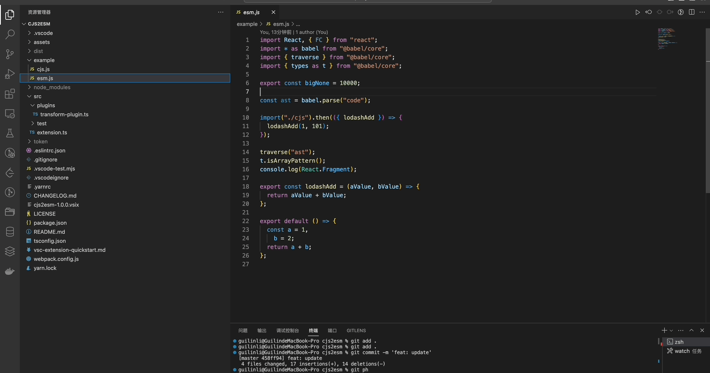

## Release Notes

- commonJs esModule 互转插件

### 1.0.0

---

- Change CJS ⇋ ESM (`Cmd+g` on macOS or `Ctrl+g` on Windows and Linux).
- Change ESM ⇋ CJS Basic Selection (`Cmd+y` on macOS or `Ctrl+y` on Windows and Linux).

### demo

## For more information

- [Visual Studio Code's Markdown Support](http://code.visualstudio.com/docs/languages/markdown)
- [@babel/plugin-transform-modules-commonjs](https://www.npmjs.com/package/@babel/plugin-transform-modules-commonjs)
- [babel-plugin-transform-commonjs](https://www.npmjs.com/package/babel-plugin-transform-commonjs)

**Enjoy!**
