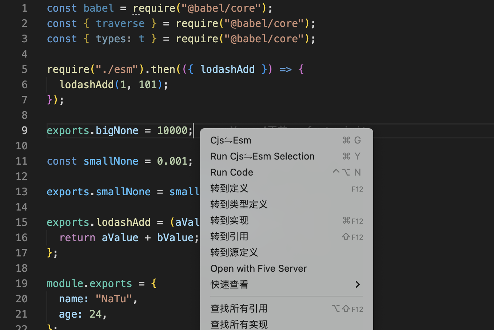

## Release Notes

初始化

### 1.0.0

---

- Change CJS ⇋ ESM (`Cmd+g` on macOS or `Ctrl+g` on Windows and Linux).
- Change ESM ⇋ CJS Basic Selection (`Cmd+y` on macOS or `Ctrl+y` on Windows and Linux).

### 效果图

## For more information

- [Visual Studio Code's Markdown Support](http://code.visualstudio.com/docs/languages/markdown)
- [Markdown Syntax Reference](https://help.github.com/articles/markdown-basics/)

**Enjoy!**
